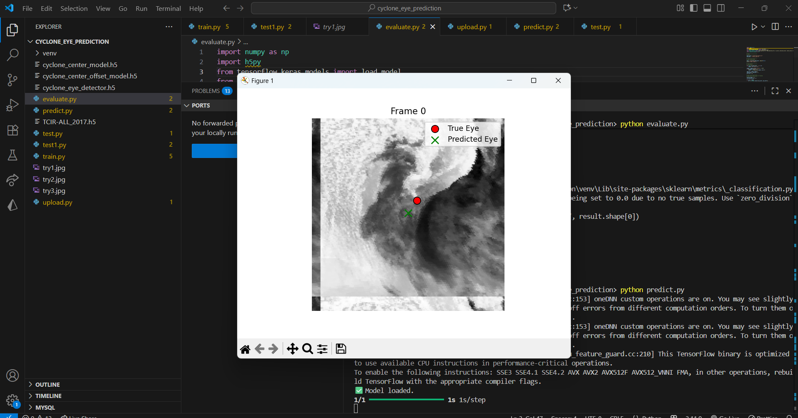
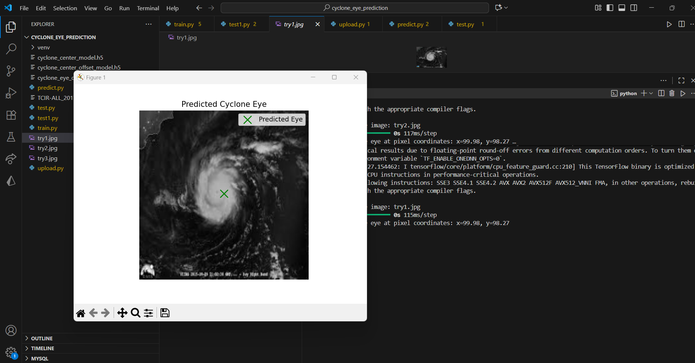
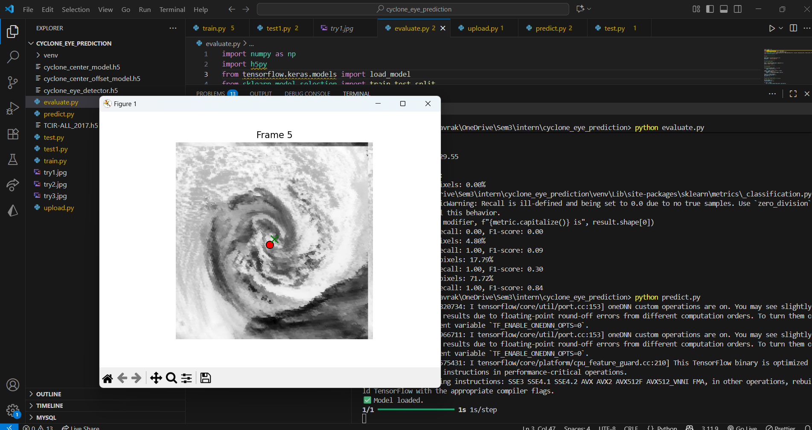
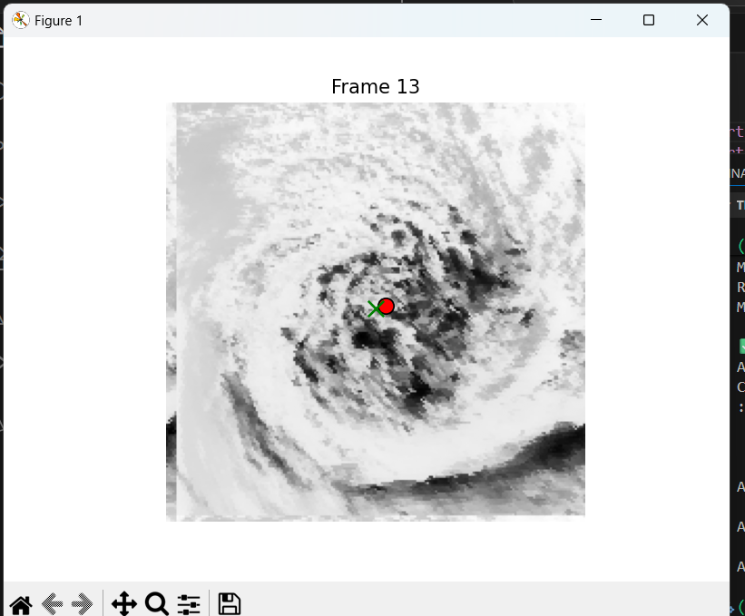

# 🌪️ Cyclone Eye Prediction using Deep Learning

<p align="center">


</p>

A deep learning-based project for detecting and predicting the **cyclone eye** from satellite images. The model is trained on the **TCIR (Tropical Cyclone Image Regression)** dataset and can predict cyclone eye locations from unseen satellite imagery.

---

## ✨ Features

- 🌪️ Cyclone eye detection from satellite images
- 🧠 Deep Learning based prediction model
- 📊 Model evaluation with performance metrics
- 📤 Upload custom satellite images for inference
- ⚡ Easy training and prediction scripts

---

## 🔹 Table of Contents
- [Setup](#setup)  
- [Dataset](#dataset)  
- [Training](#training)  
- [Prediction](#prediction)  
- [Evaluation](#evaluation)  
- [Upload](#upload)  
- [Dependencies](#dependencies)  

---

## 🔹 Setup

1. **Clone the repository**
```bash
git clone https://github.com/raveena31/cyclone_eye_prediction.git
cd cyclone_eye_prediction
```

2. **Create and activate virtual environment**
```bash
python -m venv venv
# Windows
venv\Scripts\activate
# macOS/Linux
source venv/bin/activate
```

3. **Install required packages**
```bash
pip install -r requirements.txt
```

🔹 Dataset

Download the dataset from: https://www.csie.ntu.edu.tw/~htlin/program/TCIR/
TCIR Dataset

Place the downloaded dataset in the project directory as needed by the training scripts.


🔹 Training

Run train.py to train the model and generate the cyclone_eye_detector.h5 file:
```bash
python train.py
```

This will create the trained model in your project directory.


🔹 Prediction

Use predict.py to test the trained model on test images:

```bash
python predict.py 
```

This will output predictions for the given image(s).


🔹 Evaluation

Use evaluate.py to compute model metrics (accuracy, precision, recall, etc.):
```bash
python evaluate.py
```

🔹 Upload

upload.py allows users to upload images for prediction:
```bash
python upload.py
```


Follow the prompts to provide an image for model inference.

## 🔹 Example Predictions

Here are some example outputs from the trained model:







